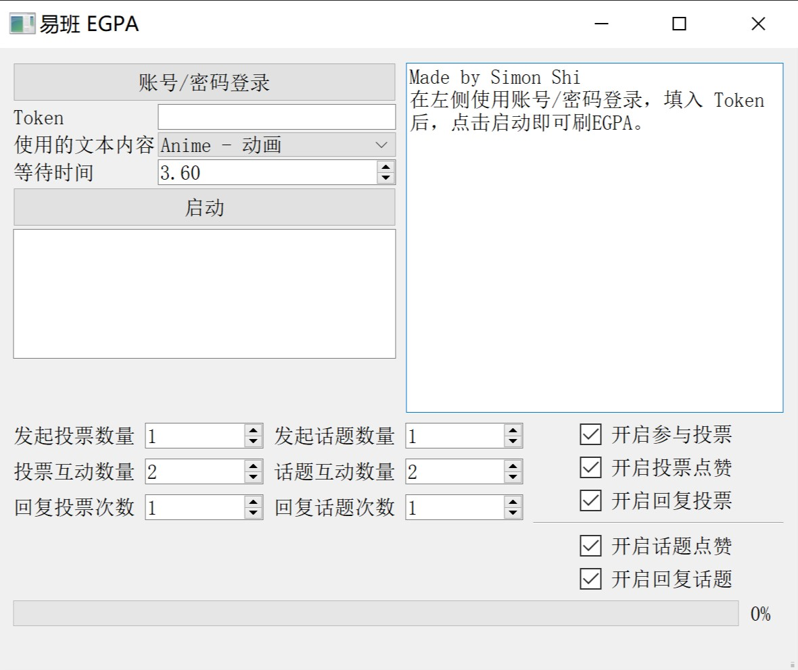

## yiban EGPA tool

易班EGPA工具是使用Python语言构建的开源的工具，使用yiban-api调用网页接口，使用PyQt5作为界面设计，实现方便的自动化易班使用功能。
具体功能在软件中有介绍。

## yiban-api
易班API的使用是为了更方便地使用Python进行网页接口的调用。

## License
GPLv3

## Credit
Copyright © 2017-2018 simonsmh